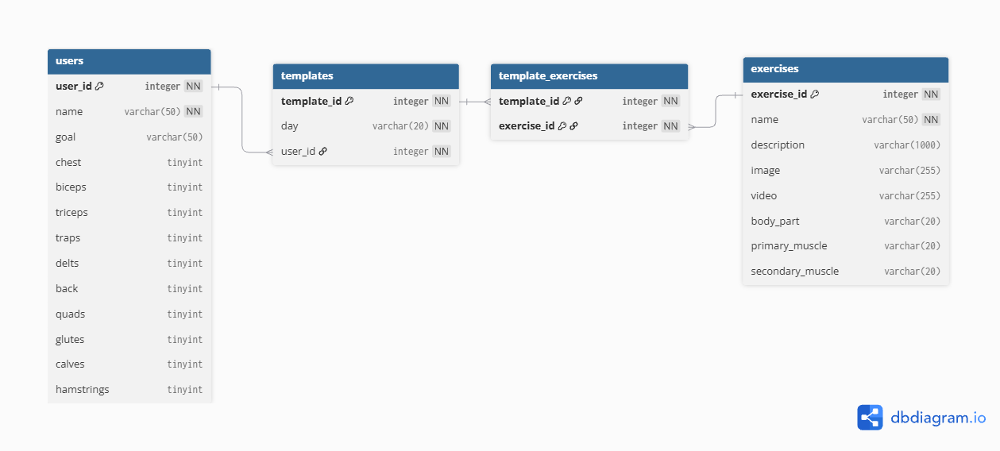

# DB-Assignment-5: Database Queries & Concepts

---

## 1. Group Physical Model Link
* **Physical Database Model:** 

---

## 2. Group Database Creation Scripts

```sql
CREATE TABLE users (
    user_id INT AUTO_INCREMENT PRIMARY KEY,
    name VARCHAR(50) NOT NULL,
    goal VARCHAR(50),
    chest TINYINT,
    biceps TINYINT,
    triceps TINYINT,
    traps TINYINT,
    delts TINYINT,
    back TINYINT,
    quads TINYINT,
    glutes TINYINT,
    calves TINYINT,
    hamstrings TINYINT
);

CREATE TABLE exercises (
    exercise_id INT AUTO_INCREMENT PRIMARY KEY,
    name VARCHAR(50) NOT NULL,
    description VARCHAR(1000),
    image VARCHAR(255),
    video VARCHAR(255),
    body_part VARCHAR(20),
    primary_muscle VARCHAR(20),
    secondary_muscle VARCHAR(20)
);

CREATE TABLE templates (
    template_id INT AUTO_INCREMENT PRIMARY KEY,
    day_of_week VARCHAR(12) NOT NULL,
    user_id INT NOT NULL,
    CONSTRAINT fk_templates_users 
        FOREIGN KEY (user_id) REFERENCES users(user_id) 
        ON DELETE CASCADE
);

CREATE TABLE template_exercises (
    template_id INT NOT NULL,
    exercise_id INT NOT NULL,
    PRIMARY KEY (template_id, exercise_id),
    CONSTRAINT fk_te_templates 
        FOREIGN KEY (template_id) REFERENCES templates(template_id) 
        ON DELETE CASCADE,
    CONSTRAINT fk_te_exercises 
        FOREIGN KEY (exercise_id) REFERENCES exercises(exercise_id) 
        ON DELETE CASCADE
);
```
---

## What is a SQL Query?

A SQL (Structured Query Language) query is a precise instruction or command issued to a relational database management system to perform operations on stored data.

SQL queries allow developers and database administrators to:

* Create tables
* Insert new data
* Update existing records
* Delete entries
* Retrieve specific datasets based on business requirements

---

## Describe the Parts of a SELECT Statement

A standard `SELECT` query retrieves data from one or more tables.

### `SELECT`

Specifies the column names or expressions to return in the result set.

For example:

```sql
SELECT username, email
```

Using `*` selects all available columns.

### `FROM`

Identifies the primary table or dataset source from which to fetch the records.

```sql
FROM users
```

### `JOIN`

Combines rows from two or more tables based on a related column between them.

```sql
INNER JOIN logs 
    ON users.id = logs.user_id
```

### `WHERE`

Filters records before any grouping occurs based on specific comparison conditions.

### `GROUP BY`

Groups rows that have the same values into summary rows. It is typically used with aggregate functions such as:

* `COUNT()`
* `SUM()`
* `AVG()`
* `MAX()`
* `MIN()`

### `HAVING`

Filters groups created by the `GROUP BY` clause based on aggregate condition logic.

### `ORDER BY`

Sorts the resulting output rows in ascending (`ASC`) or descending (`DESC`) order based on specified attributes.


---

## Describe How to Filter a Query

Filtering isolates specific records in a dataset using criteria defined in the `WHERE` clause.

For aggregate data, filtering can also be performed using the `HAVING` clause.

For example:

```sql
SELECT *
FROM users
WHERE goal = 'Build Muscle';
```

The `WHERE` clause filters individual rows before grouping occurs.

---

## What Are Database Indexes and What Are the Benefits of Them?

A database index is a specialized, fast-lookup data structure, typically implemented using structures such as **B-Trees** or **Hash indexes**, that is built on specific table columns to speed up search operations without scanning every row in a table.

### Key Benefits

* **Accelerated Query Performance:** Indexes can reduce the need for sequential full-table scans by allowing the database to locate matching records more efficiently.
* **Faster Sorting and Grouping:** Indexes can improve operations that rely on `ORDER BY` and `GROUP BY`.
* **Efficient Data Retrieval:** Queries that frequently search or filter using indexed columns can execute more efficiently.
* **Improved JOIN Performance:** Indexes on columns used for joins can help the database locate related records more efficiently.

---

# Project Theme SQL Queries

## Query 1: Display User Workout Template Details Along With Total Assigned Exercises

```sql
SELECT 
    u.user_id,
    u.name AS user_name,
    t.template_id,
    t.day_of_week,
    COUNT(te.exercise_id) AS total_exercises
FROM users u
INNER JOIN templates t 
    ON u.user_id = t.user_id
LEFT JOIN template_exercises te 
    ON t.template_id = te.template_id
GROUP BY 
    u.user_id, 
    u.name, 
    t.template_id, 
    t.day_of_week
ORDER BY 
    u.user_id, 
    FIELD(
        t.day_of_week, 
        'Monday', 
        'Tuesday', 
        'Wednesday', 
        'Thursday', 
        'Friday', 
        'Saturday', 
        'Sunday'
    );
```

### Query 1 Description

This query performs an `INNER JOIN` between `users` and `templates`, and a `LEFT JOIN` with `template_exercises` to count the total number of assigned exercises per template for each user using `COUNT()`.

The results are grouped by the user and template details. The results are then sorted by `user_id` and sequentially by the day of the week using the `FIELD()` function.

---

## Query 2: Fetch Exercises Targeting Specific Primary Muscles With Their Associated Template Count

```sql
SELECT 
    e.exercise_id,
    e.name AS exercise_name,
    e.body_part,
    e.primary_muscle,
    e.secondary_muscle,
    COUNT(te.template_id) AS total_template_usage
FROM exercises e
LEFT JOIN template_exercises te 
    ON e.exercise_id = te.exercise_id
WHERE e.primary_muscle IN ('Chest', 'Quads', 'Back')
GROUP BY 
    e.exercise_id, 
    e.name, 
    e.body_part, 
    e.primary_muscle, 
    e.secondary_muscle
HAVING COUNT(te.template_id) >= 1
ORDER BY 
    total_template_usage DESC, 
    e.name ASC;
```

### Query 2 Description

This query joins `exercises` with `template_exercises` using a `LEFT JOIN` to analyze exercise usage across saved templates.

It uses an `IN` clause to filter for specific primary target muscles:

* `Chest`
* `Quads`
* `Back`

The query applies a `HAVING` clause to show only exercises that are assigned to at least one template.

Finally, the results are sorted by template usage in descending order, followed by the exercise name in ascending alphabetical order.

### Query 3: Retrieve the total number of registered users in the system

```sql
SELECT COUNT(*) AS total_users
FROM users;
```