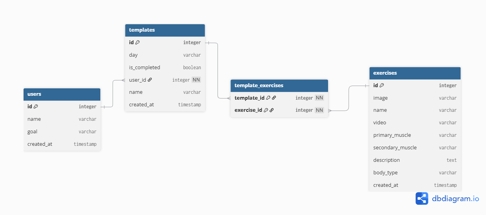

# Database Design Assignment 2: Logical Model

## Term Definitions

* **Purpose of a Logical Model:** Explains how data entities relate structurally.
* **Primary Key:** A unique identifier for each record or row in a table that ensures every entry can be distinctly identified.
* **Foreign Key:** A field or column in one table that links directly to the primary key of another table to establish relationships and enforce referential integrity.
* **Relationships Between Entities:** The structural connections between tables, categorized by cardinality (e.g., One-to-One, One-to-Many, Many-to-Many).
* **Normalization:** The process of organizing database fields and tables to minimize data redundancy and improve data integrity.

---

## Group Conceptual Model

* [Group Conceptual Model Link](https://lucid.app/lucidchart/ddb6b0df-f50c-4f18-a837-20662dc80403/edit?viewport_loc=-60%2C-361%2C2745%2C1683%2C0_0&invitationId=inv_1ecdf2b8-76d8-435b-a615-d1acec13cad0)

---

## Logical Model Diagram

---

## Logical Model Description

* **Users :** Represents application users storing basic account and goal metadata. `id` serves as the primary key.
* **Templates :** Stores workout day plans belonging to users. It contains a foreign key `user_id` referencing `users.id`, establishing a One-to-Many relationship (a user can have multiple workout templates).
* **Exercises :** Defines individual exercises with target muscles, body types, and media references. `id` acts as the primary key.
* **Template Exercises :** Resolves the Many-to-Many relationship between templates and exercises (a template contains multiple exercises, and an exercise can appear in multiple templates). It uses a composite primary key formed by `(template_id, exercise_id)` alongside foreign key references to `templates.id` and `exercises.id`.