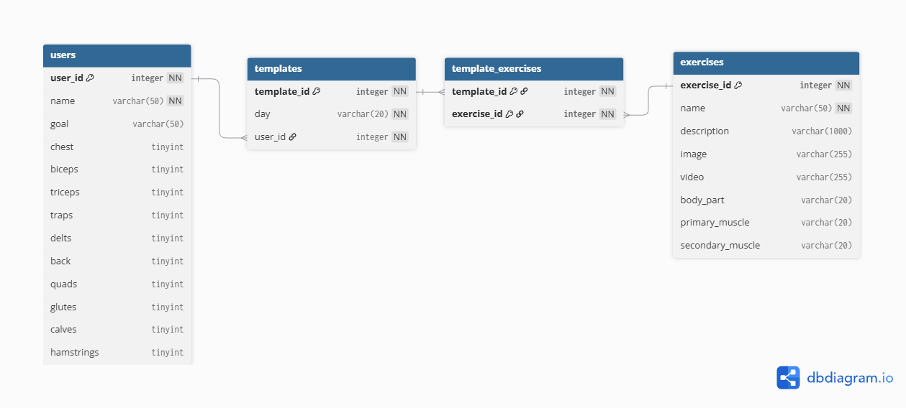

## Physical Model Diagram



## Group Logical Model Link
* [Group Logical Model](../Logical_model.png)

### Conceptual/Logical vs. Physical Model
* **Conceptual Model:** High-level view that identifies key entities and their business relationships without technical details.
* **Logical Model:** Defines entities, attributes, primary/foreign keys, and data relationships independently of any specific database software.
* **Physical Model:** Platform-dependent implementation model tailored to a specific Database Management System (DBMS). It specifies exact data storage types, column sizes, indexes, default values, nullability constraints, foreign key referential integrity rules.

### Common Data Types (MariaDB)
* **`INT` / `INTEGER`:** Standard 4-byte integer used for auto-incrementing surrogate primary keys, foreign keys, and integer counts.
* **`VARCHAR(N)`:** Variable-length character string with a defined max limit. Used for names, titles.
* **`TEXT`:** Variable-length string used for storing unstructured text or long descriptions without requiring a pre-specified length constraint.
* **`DATETIME` / `TIMESTAMP`:** Date and time values formatted as `YYYY-MM-DD HH:MM:SS`.

### Default & Null Values
* **`NULL` vs. `NOT NULL`:** `NOT NULL` requires a column to contain a valid value upon record insertion, ensuring required attributes (e.g., entity names or foreign keys) are never left blank. `NULL` permits optional attributes.
* **`DEFAULT`:** Specifies a fallback value automatically applied by the database engine during record creation if no value is explicitly supplied.

### Check Constraints
* **Check Constraints (`CHECK`):** Evaluates boolean conditions on table columns during `INSERT` or `UPDATE` operations to maintain domain integrity. If a record violates the rule (e.g., verifying `volume_count >= 0`), the DBMS rejects the write operation.

### Description of Physical Model

1. **`users` Table:** Stores user information, fitness goals, and target weekly set counts for each muscle group. Muscle counts default to `0` using `DEFAULT: 0` so empty targets start at zero instead of causing null errors in calculations.
2. **`templates` Table:** Stores workout routines assigned to specific days (such as "Leg Day" or "Push Day"). Every template belongs to a user through the `user_id` foreign key.
3. **`exercises` Table:** Acts as the master exercise library. Media fields (`image`, `video`) use `VARCHAR(255)` to hold link URLs, while execution instructions use `TEXT` so descriptions can be as long as needed.
4. **`template_exercises` Table:** Connects `templates` and `exercises` in a many-to-many relationship. It uses a combined primary key `(template_id, exercise_id)` to prevent the same exercise from being added twice to a single template.

### Relationships & Rules
* **`users` to `templates`:** Linked by `templates.user_id`. If a user account is deleted, `ON DELETE CASCADE` automatically deletes all of their saved workout templates.
* **`templates` to `template_exercises`:** Linked by `template_exercises.template_id`. If a template is deleted, `ON DELETE CASCADE` removes all exercise mappings inside that template.
* **`exercises` to `template_exercises`:** Linked by `template_exercises.exercise_id`. If an exercise is deleted from the master library, `ON DELETE CASCADE` automatically removes it from any templates using it, keeping the database clean.

```dbml
Table users {
  user_id integer [pk, increment]
  name varchar(100) [not null]
  goal varchar(50)
  chest integer [default: 0]
  biceps integer [default: 0]
  triceps integer [default: 0]
  traps integer [default: 0]
  delts integer [default: 0]
  back integer [default: 0]
  quads integer [default: 0]
  glutes integer [default: 0]
  calves integer [default: 0]
  hamstrings integer [default: 0]
}

Table templates {
  template_id integer [pk, increment]
  day varchar(20) [not null]
  user_id integer [not null]
}

Table exercises {
  exercise_id integer [pk, increment]
  name varchar(100) [not null]
  description text
  image varchar(255)
  video varchar(255)
  body_part varchar(50)
  primary_muscle varchar(50)
  secondary_muscle varchar(50)
}

Table template_exercises {
  template_id integer [not null]
  exercise_id integer [not null]

  indexes {
    (template_id, exercise_id) [pk]
  }
}

Ref: templates.user_id > users.user_id [delete: cascade]
Ref: template_exercises.template_id > templates.template_id [delete: cascade]
Ref: template_exercises.exercise_id > exercises.exercise_id [delete: cascade]